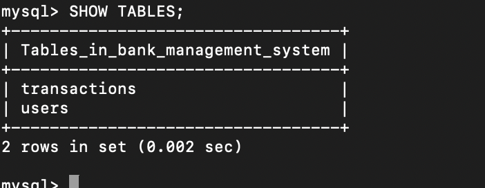
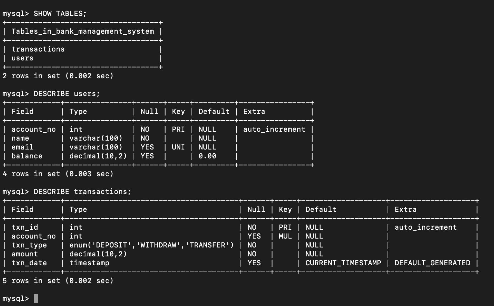
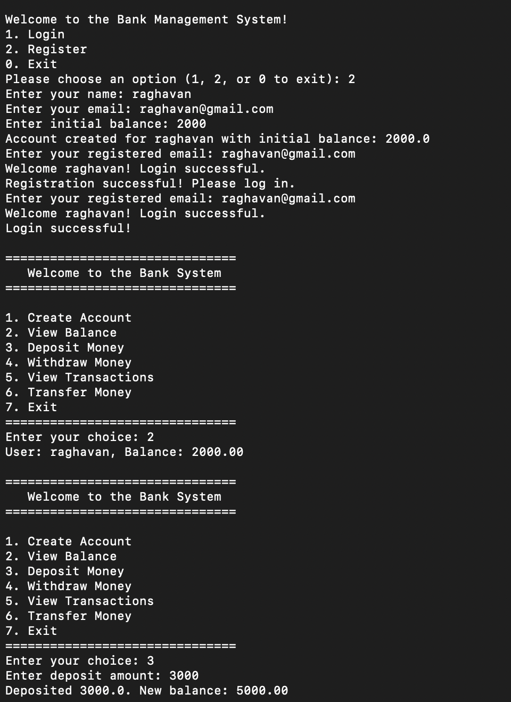
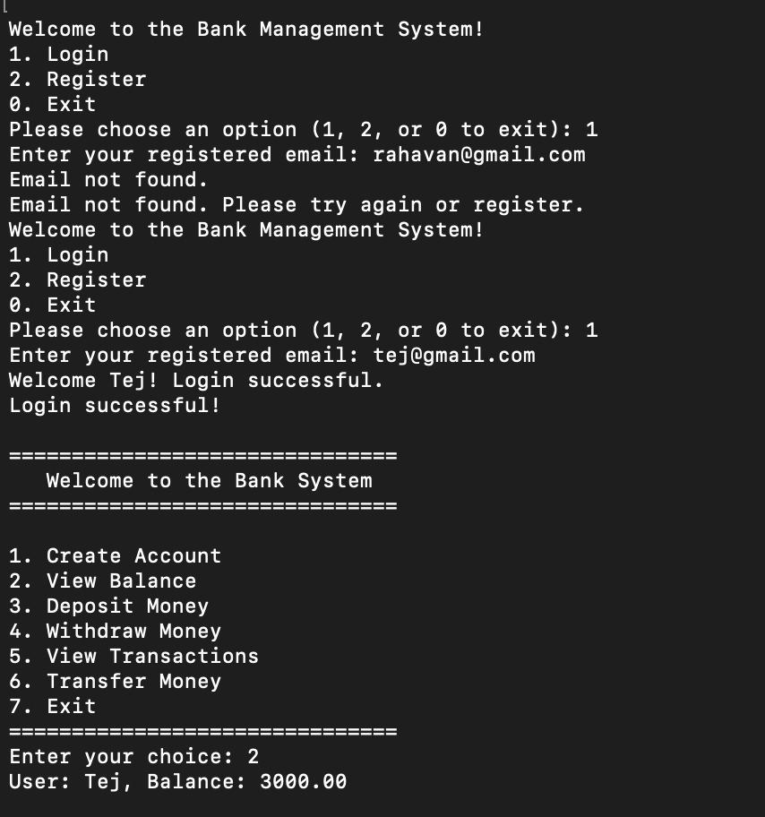
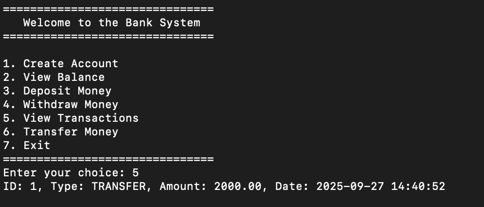
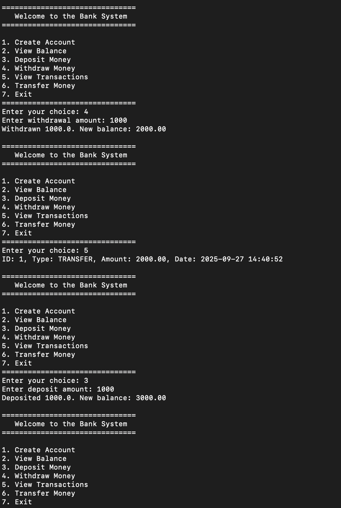

# 🏦 **Bank Management System**

## 💸 **Overview**

The **Bank Management System** is a Python-based banking application that allows users to register, login, view balance, deposit and withdraw money, view transaction history, and transfer funds. This system connects to a MySQL database for storing user and transaction details.

---

## 💻 **Features**

- **User Authentication**: Login and Registration system with email verification.
- **Account Management**: Create a new account and view balances.
- **Transactions**: Deposit, Withdraw, and Transfer money between accounts.
- **Transaction History**: View all past transactions.

---

## ⚙️ **Technologies Used**

- **Python 3.12**: Programming language used for development.
- **MySQL**: Used as the database system.
- **MySQL Connector**: Python library for connecting to MySQL.
- **SQLite**: Temporary database for testing.
- **Terminal**: For running the application.

---
## 📸 **Screenshots**

Here is a quick demo of how the application works:
### Tables**



### 1. **User Registration**



This is the user registration screen, where users can sign up by providing their name, email, and password.

### 2. **User Login**


This is the login screen, where users can enter their credentials to access their accounts.

### 3. **Transaction History View**


Here is the view where users can check their past transactions (deposits, withdrawals, transfers).

### 4. **Deposit/Withdrawal/Transfer Actions**


A snapshot showing how users can deposit or withdraw money from their account, as well as transfer funds to other accounts.

---


## 🛠️ **Setup & Installation**

1. **Clone the Repository**

    ```bash
    git clone https://github.com/your-username/bank-management-system.git
    cd bank-management-system
    ```

2. **Create a Virtual Environment**

    ```bash
    python3 -m venv .venv
    source .venv/bin/activate
    ```

3. **Install Requirements**

    Create a `requirements.txt` file with necessary dependencies like `mysql-connector-python` and any other libraries your project needs.

    ```bash
    pip install -r requirements.txt
    ```

---
## 🔑 **Database Setup**

Make sure you have MySQL installed and set up a database called **`bank_management_system`**.

### 📂 **Create the Database**

Follow these steps to create the database and perform basic queries:

1. **Create the Database**:

    ```sql
    CREATE DATABASE bank_management_system;
    ```

2. **Select the Database**:

    ```sql
    USE bank_management_system;
    ```

3. **Show All Tables**:

    To view all the tables in the selected database:

    ```sql
    SHOW TABLES;
    ```

4. **Describe the `users` Table**:

    To view the structure of the `users` table (including columns, data types, etc.):

    ```sql
    DESCRIBE users;
    ```

5. **View All Records in the `users` Table**:

    To see all the user data stored in the `users` table:

    ```sql
    SELECT * FROM users;
    ```

6. **Count the Number of Users**:

    To count how many users are currently in the `users` table:

    ```sql
    SELECT COUNT(*) FROM users;
    ```

